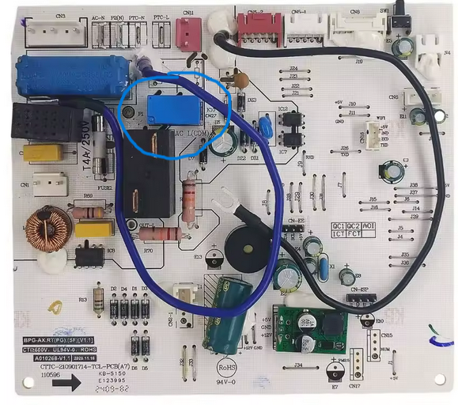
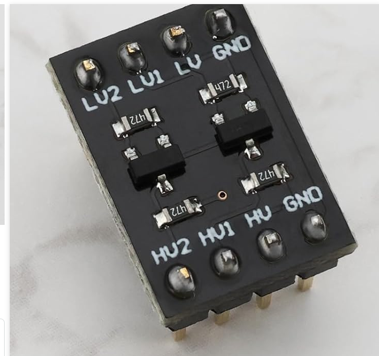
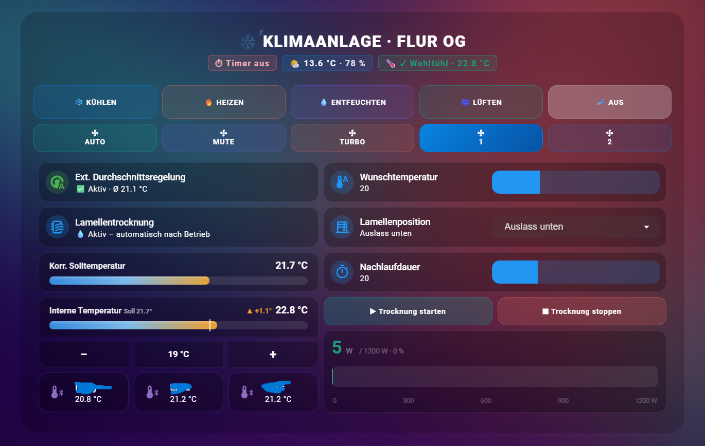

# esphome-danyon-klima

ESPHome-Komponente für **Danyon Split-Klimaanlagen** via UART, basierend auf [KG3RK3N/esphome-kaeltebringer](https://github.com/KG3RK3N/esphome-kaeltebringer).

## Was ist in diesem Fork anders

Die originale Komponente konnte den Swing-Status korrekt auslesen, hat die Lamellen beim Senden von Befehlen jedoch **nie tatsächlich bewegt**. Der Grund: die `_mv` (Motion/Bewegungs-) Bits wurden im ausgehenden SET-Befehl nie gesetzt, weshalb das Gerät Swing-Anfragen still ignorierte.

### Bugfix: `hswing_mv` / `vswing_mv`

In `build_set_cmd` fehlten zwei Zeilen:

```cpp
// Original (fehlerhaft)
m_set_cmd.data.vswing = get_cmd_resp->data.vswing ? 0x07 : 0x00;
m_set_cmd.data.hswing = get_cmd_resp->data.hswing;

// Behoben
m_set_cmd.data.vswing    = get_cmd_resp->data.vswing ? 0x07 : 0x00;
m_set_cmd.data.vswing_mv = get_cmd_resp->data.vswing ? 0x01 : 0x00;  // ← NEU
m_set_cmd.data.hswing    = get_cmd_resp->data.hswing;
m_set_cmd.data.hswing_mv = get_cmd_resp->data.hswing ? 0x01 : 0x00;  // ← NEU
```

Der Fehler wurde durch den Vergleich von UART-Paketmitschnitten bei Swing AN vs. AUS mit aktiviertem VERBOSE-Logging identifiziert.

### Neue Methoden

**`test_vswing_fix(uint8_t fix_val, uint8_t mv_val)`**  
Setzt eine feste vertikale Lamellenposition. Durch systematisches Testen der `vswing_fix`-Werte 1–7 entdeckt. Positionen 1–5 ergeben unterschiedliche Winkel bei Danyon-Geräten (1 = fast geschlossen, 5 = ganz nach unten).

**`set_fan_mute()`**  
Setzt den Lüfter auf Mute-Modus mit explizitem `power=1` und `mode=FAN_ONLY`. Kann sicher aufgerufen werden auch wenn das Gerät vorher im OFF-Zustand war.

**`send_clean()`** *(experimentell)*  
Versucht den eingebauten Selbstreinigungszyklus des Geräts auszulösen. Basiert auf der UART-Paketanalyse während eines über die Originalfernbedienung gestarteten Reinigungszyklus. Funktioniert möglicherweise nicht bei allen Geräten.

---

## Hardware

Getestet an: **Danyon Split-Klimaanlage, Flur OG**

Anschluss: **diymore ESP32 NodeMCU (USB-C)** → bidirektionaler Levelshifter (3,3V ↔ 5V) → UART der Inneneinheit

```
ESP32 GPIO26  →  TX  →  Levelshifter  →  Klimaanlage RX
ESP32 GPIO27  →  RX  →  Levelshifter  →  Klimaanlage TX
Baudrate: 9600, Parität: EVEN
```

**Verwendete Bauteile:**
- [ESP32 NodeMCU USB-C (diymore)](https://amzn.to/4fFoX1l)
- [Bidirektionaler Levelshifter 3,3V ↔ 5V](https://amzn.to/4ehPtLU)

## Fotos

Hauptplatine der Inneneinheit:


Levelshifter-Modul (3,3V ↔ 5V):


---

## Konfiguration

```yaml
external_components:
  - source:
      type: git
      url: https://github.com/varan81/esphome-danyon-klima
    components: [kaeltebringer]

uart:
  id: uart_bus
  tx_pin: GPIO26
  rx_pin: GPIO27
  baud_rate: 9600
  parity: EVEN
  rx_buffer_size: 512

climate:
  - platform: kaeltebringer
    uart_id: uart_bus
    name: "Danyon Klimaanlage"
    update_interval: 10s
    beep_enabled: false
```

---

## Unterstützte Funktionen

| Funktion | Status |
|---|---|
| KÜHLEN / HEIZEN / ENTFEUCHTEN / LÜFTEN / AUTO | ✅ |
| Swing AUS / HORIZONTAL / VERTIKAL / BEIDES | ⚠️ Fix eingespielt, nicht getestet (Fernbedienung unterstützt kein Schwingen am Testgerät) |
| Feste vertikale Lamellenpositionen (1–5) | ✅ getestet an Danyon-Gerät |
| Lüftermodi: Automatisch / 1–5 / Turbo / Mute | ✅ |
| Ist-Temperatur (interner Sensor) | ✅ |
| Solltemperatur | ✅ |
| Selbstreinigung | ⚠️ experimentell |

---

## Dashboard

Ein fertiges Home Assistant Dashboard liegt unter [`examples/dashboard_example.yaml`](examples/dashboard_example.yaml).



### Wie die externe Durchschnittstemperaturregelung funktioniert

Dieses Setup ist für eine **zentral im Flur hängende Klimaanlage** konzipiert, die mehrere angrenzende Zimmer versorgt. Anstatt sich auf den eingebauten Sensor der Klimaanlage zu verlassen (der nur die Lufttemperatur direkt am Gerät misst), wird der Durchschnitt aus Bluetooth-Temperatursensoren in den einzelnen Zimmern berechnet:

- Ein **BTHome Bluetooth-Sensor** pro Zimmer
- Der ESP32 liest alle Sensorwerte über Home Assistant
- Aus allen verfügbaren Sensoren wird eine **Durchschnittstemperatur** berechnet
- Die Solltemperatur der Klimaanlage wird automatisch korrigiert, basierend auf der Differenz zwischen dem internen Sensor und dem Raumdurchschnitt

Das bedeutet: Die Klimaanlage kühlt oder heizt auf die tatsächliche Raumtemperatur – nicht die Temperatur direkt am Gerät. Fällt ein Sensor aus, wird er automatisch aus der Berechnung ausgeschlossen.

Das Dashboard zeigt drei Raumsensoren (im Beispiel als Zimmer 1, Zimmer 2, Zimmer 3 bezeichnet – nach Bedarf umbenennen). Der externe Durchschnitt wird direkt in der Karte "Ext. Durchschnittsregelung" angezeigt.

---

## Danksagung

- Originale Komponente: [KG3RK3N/esphome-kaeltebringer](https://github.com/KG3RK3N/esphome-kaeltebringer)  
- Basiert auf der Arbeit von [lNikazzzl](https://github.com/lNikazzzl/tcl_ac_esphome)

---

<a href="https://www.buymeacoffee.com/varan81" target="_blank"></a>
